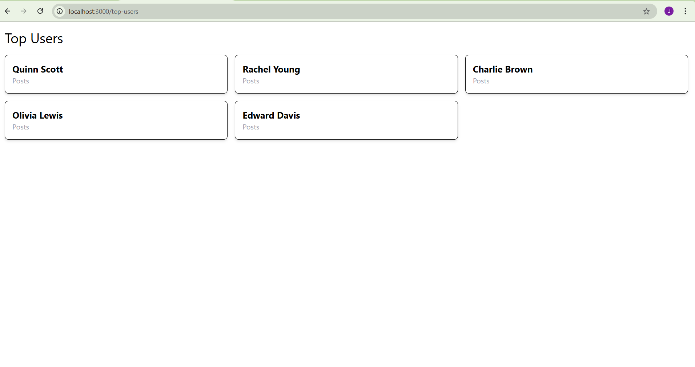

### First Run Backend

cd Question_1

npm i

node index.js

Backend port is 5000

### Then Run React

cd Question_2

npm i

npm run dev -- --port 3000

Frontend post is 3000

## ScteenShots

### Question 1

### Question 2

